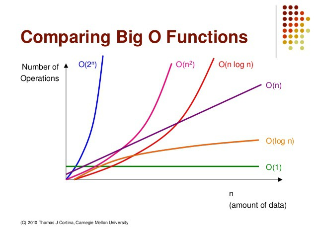

# Big O Notation
##  빅오 표기법의 필요성
- 알고리즘에는 여러가지 해결법이 있고 이러한 코드들의 성능을 평가할 수 있는 방법이 필요함
  - 어떤 알고리즘의 성능이 더 좋은지 수치로 표기할 수 있다.
  - 빅오를 통해서 알고리즘의 장단점에 대해서 설명할 수 있다.
  - 코드가 느리거나 문제가 있을 때 빅오를 통해서 문제를 유추 가능.

## 코드 시간 재기
- `performance.now()` 메서드를 통해 걸린 시간을 측정 가능하지만 한계가 있다.
  - 같은 기계에서도 시간에 매번 오차가 있다.(다른기계에서 측정하면 또 다름)
  - 모든 코드를 시간으로 재는 것은 비효율

### 연산 갯수 세기
- 직접 퍼포먼스의 시간을 재기보다는 컴퓨터의 연산 갯수를 세어 Big O로 나타낼 수 있다.
- 정확한 시간이 아니라 큰 그림으로 알고리즘을 분석해야한다는 것.
- 왜 Big O로 코드의 성능을 측정하는 것인가?라고 했을때
- 직접 시간을 재는 것보다 컴퓨터의 연산 갯수로 성능을 표기했을 때 훨씬 간단하고 효율적으로 판단할 수 있기 때문.

## BigO란
- 인자값의 수가 늘어날 때 실행 시간이 변하는 관계를 그래프로 표시.
- 즉, 입력의 크기와 실행시간의 관계

- O(1)
- O(log n)
- O(n)
- O(nlog n)
- O(n2)

## 빅오 표현식 단순화 하기
- 전반적인 추세, 그래프의 모양을 보기 때문에 상수는 제거하고 단순화 표현.
  - 5n+2 => n
  - 2n => n

## 공간 복잡도
- 메모리를 얼마나 사용하느냐를 표기한 것.
  - boolean, number, undefined, null : O(1)
  - string : O(n)
  - object, array : O(n)

## 로그와 섹션
- 로그함수와 지수함수는 짝이다.
  - log 8 => 3
  - log 16 => 4
  - log 32 => 5
  - log 64 => 6
  - log 128 => 7
  - log 256 => 8

## 정리
- 빅오 표기법이란 알고리즘의 성능을 표기할 수 있는 측정법이며
인자값이 커질수록 실행 시간이 어떻게 변하는지를 그래프로 나타낸 전반전인 추세를 나타낸 값이다.
- 빅오로 표기하는 값은 하드웨어에 영향을 받지 않는다. 
