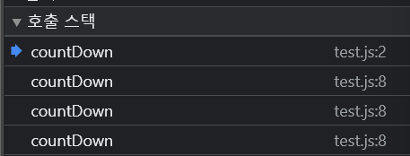

# Recursion(재귀)
- 자기자신을 호출하는 함수
- 재귀함수에서 중요한 부분
  - Base Case : 라인을 끝내는 종료 조건
  - Different input : 다른 입력값
- 위 두가지 조건을 제대로 설정하지 않으면 무한 호출되기 때문에 stack 최대 사이즈를 넘게됨.
  - stack overflow

## Why need?
- JSON.parse, JSON.stringify, getElementById 등은 실제로 재귀함수로 구현되고 있다.
- 이러한 함수를 우리가 직접 구현해보려면 재귀함수 사용법을 알고 있어야 한다.

## Call stack
- 자바스크립트는 함수를 호출하기 위해 콜스택에 함수를 쌓아놓은 뒤 LIFO 구조로 실행시킨다.
- 재귀 함수 실행시 콜스택에 같은 함수가 계속 쌓이는 것을 확인할 수 있음.
```jsx
function countDown(num){
    if(num<=0){
        console.log("all done");
        return;
    }
    console.log(num);
    num--;
    countDown(num)
}

countDown(5);
```



## Helper method recursion
- 재귀적이지 않은 외부 함수가 재귀적인 내부 함수를 호출하는 패턴
```jsx
// input : [1,2,3,4,5,6,7,8,9]
// output : [1,3,5,7,9]

// recursive solution
function collectOddValues(arr){
    let result = [];
    function helper(helperArr){
        if(helperArr.length <= 0) return;
        if(helperArr[0] % 2 !== 0){
            result.push(helperArr[0])
        }
        helper(helperArr.slice(1))
    }
    helper(arr);
    return result;
}

// iterative solution
function collectOddValues(arr){
    let result = [];
    for(let i=0; i<arr.length; i++){
        if(arr[i] % 2 !== 0) result.push(arr[i]);
    }
    return result;
}

collectOddValues([1,2,3,4,5,6,7,8,9]);
```

## Pure recursion
- array 복사 : `slice`, `spread operator`, `concat`
- string 복사 : `slice`, `substr`, `substring`
- object 복사 : `Object.assign`, `spread operator`
```jsx
// input : [1,2,3,4,5,6,7,8,9]
// output : [1,3,5,7,9]

function collectOddValues(arr){
     let newArr = [];
     if(arr.length === 0) return newArr;
     if(arr[0] % 2 !== 0){
         newArr.push(arr[0]);
     }
     newArr = newArr.concat(collectOddValues(arr.slice(1)));
     return newArr;
}

console.log(collectOddValues([1,2,3,4,5,6,7,8,9]))
```